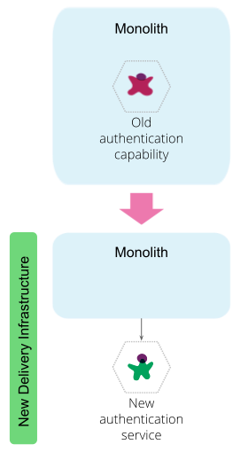

# 如何将单体应用分解为微服务

[TOC]


## 什么时候解耦

随着单体系统变得太大而无法处理，许多企业被吸引到将它们分解为微服务架构风格。 这是一段非常值得但艰辛的旅程。 我们知道，要做好这件事，我们需要从一个简单的服务开始，然后提取成对于业务有重要意义、变更频繁、垂直功能的服务。 这些简单服务服务一开始会很大，而且尽可能不依赖于剩余的单体系统。 我们应该确保迁移的每一步都代表着对整体架构的原子性改变。

将单体系统迁移到微服务生态系统是一段史诗般的旅程。踏上这一旅程的人的愿望是扩大运营规模，加快变革步伐，摆脱高昂的变革成本。他们希望增加团队的数量的同时使他们能够并行且彼此独立地交付价值。他们希望快速试验业务的核心能力并更快地交付价值。他们还希望避免因更改现有单体系统而产生的高昂成本。

决定何时以及如何增量迁移的解耦能力是将单体架构分解为微服务生态系统的一些架构挑战。在这篇文章中，我分享了一些可以指导交付团队（开发人员、架构师、技术经理）在整个过程中做出分解决策的技术。

为了阐明这些技术，我使用了一个多层在线零售应用程序。该应用程序将用户界面、业务逻辑和数据层紧密结合在一起。我选择这个例子的原因是它的架构具有许多企业运行的单体应用程序的特征，并且它的技术堆栈足够现代，可以证明分解的合理性，而不是只是完全重写和替换。


## 微服务生态系统目的地

在开始之前，每个人都对微服务生态系统有一个共同的理解是至关重要的。 微服务生态系统是一个服务（S）的平台，每个服务都封装了一种业务能力。 业务能力表示企业在特定领域中为实现其目标和职责所做的工作。 每个微服务都公开了一个 API，开发人员可以以自助方式发现和使用该 API。 微服务具有独立的生命周期。 开发人员可以独立构建、测试和发布每个微服务。 微服务生态系统强制执行由长期自治团队组成的组织结构，每个团队负责一项或多项服务。 与一般看法相反的是，微服务的“微”，每个服务的大小最不重要，并且大小可能严重依赖于组织的运营成熟度。 正如 Martin Fowler 所说，“微服务是一个标签，而不是描述”。


图 1：服务封装业务能力，通过自助 API 公开数据和功能


## 旅程指南

在深入了解本指南之前，重要的是要知道将现有系统分解为微服务的总体成本很高，并且可能需要多次迭代。 开发人员和架构师有必要仔细评估现有单体的分解路径是否是正确，以及微服务本身是否是正确的目的地。 清除了这一点，让我们看一下指南。

### 使用简单且相当解耦的功能进行热身

启动微服务旅途需要最低级别的操作准备。宝库按需访问部署环境，构建新型的持续交付管道以支持独立构建、测试和部署可执行的服务，以及能保护、调试和监控分布式架构的能力。无论我们是在构建新建服务还是分解现有系统，都需要成熟的运营准备。有关此操作准备的更多信息，请参阅 Martin Fowler 关于微服务先决条件的文章。好消息是，自从 Martin 发表文章以来，运行微服务架构的技术发展非常迅速。这包括  Service Mesh -- 一个专用的基础架构层，用于运行快速、可靠和安全的微服务网络、容器编排系统以提供更高级别的部署基础架构抽象，以及持续交付系统（如 GoCD）的演进以支持将微服务作为容器进行构建、测试和部署。 

我的建议是开发人员和运营团队使用他们分解或构建的第一个和第二个服务来构建底层基础设施、持续交付管道和 API 管理系统。从与单体架构完全解耦的功能开始，这些功能不需要更改当前正在使用单体架构并且可能不需要数据存储的面向客户端的应用程序。交付团队目前正在优化的是验证他们的交付方法，提高团队成员的技能，并构建那些支持交付可独立部署的安全服务所需的最低基础设施，这些服务公开自助式的API。例如，对于在线零售应用程序，第一个服务可以是最终用户身份验证”服务，单体应用程序可以调用它以验证最终用户，而第二个服务可以是“客户资料”服务，为新的客户端程序提供了更好地了解用户的一个Facade 服务。

首先，我建议解耦简单的边缘服务。 接下来，我们采用不同的方法来解耦深深嵌入在单体系统中的功能。 我建议先做边缘服务，因为在旅程开始时，交付团队最大的风险是未能正确操作微服务。 因此，最好使用边缘服务来练习他们需要的操作先决条件。 一旦他们解决了这个问题，他们就可以解决单体拆分的关键性问题。




图 2：使用变化半径较小的简单功能进行热身，以建立我们的运营准备状态.


## 最小化对单体应用的依赖

作为一项基本原则，交付团队需要尽量减少新形成的微服务对单体应用的依赖。 微服务的一个主要好处是具有快速且独立的发布周期。 依赖于单体服务的数据、逻辑、API，这会将服务耦合到单体的发布周期，从而阻止了这种好处。 通常，摆脱单体应用的主要动机是成本高且锁定在其中的功能变化速度缓慢，因此我们希望通过消除对单体应用的依赖，逐步朝着解耦这些核心功能的方向前进。 如果团队在将功能构建到自己的服务中时遵循此准则，他们会发现依赖关系是相反的，是从单体应用到服务的依赖，而不是服务到单体的依赖。 这是一个理想的依赖方向，因为它不会减慢新服务的迭代速度。

考虑在零售在线系统中，“购买”和“促销”是核心功能。 “购买”在结账过程中使用“促销”，根据客户购买的商品，为他们提供符合条件的最佳促销。 如果我们需要决定接下来要解耦这两种能力中的哪一种，我建议先解耦“促销”，然后“购买”。 因为按照这个顺序，我们将依赖减少回单体。 在这个顺序中，“购买”首先锁定在单体应用中，并依赖于新的“促销”微服务。

下一个指导意见提供了其他路径来决定开发人员解耦服务的顺序。 这意味着他们可能并不总是能够避免依赖回到单体应用。 如果新服务最终会回调单体应用，我建议从单体应用中公开一个新 API，并通过新服务中的防腐层（Adaptor）访问 API，以确保单体应用概念不会 泄漏。 努力定义反映定义良好的领域概念和结构的 API，即使单体应用程序的内部实现可能不是这样。 在这种不幸的情况下，交付团队将承担更改单体产生的和测试和发布那些与单体发布相结合的新服务的成本和困难。


图 3：首先将不需要依赖单体的服务解耦，并尽量减少对单体的更改

## 尽早拆分粘性功能

我们假设此时交付团队对构建微服务感到满意并准备好解决棘手的问题。 然而，他们可能会发现自己受限于那些需要解耦的、不依赖于单体应用功能。造成这种情况的根本原因通常是单体应用中的某些功能是存在漏洞的，并没有很好地定义为领域概念，许多单体应用能力都依赖

例如，在基于 Web 的单体应用中，“（Web）Session”的概念是最常见的耦合因素之一。 在线零售示例中，Session通常是许多属性的存储桶，范围从跨越不同域边界的用户偏好（例如运输和支付偏好）到用户意图和交互（例如最近访问的页面、点击的产品和愿望清单）。 除非我们解决解耦、解构和具体化当前的“Session”概念，否则我们将难以解耦许多未来的功能，因为它们将通过泄漏的Session概念与单体纠缠在一起。 我也不鼓励在单体应用程序之外创建“Session”服务，因为它只会导致类似于当前存在于单体应用程序中的紧密耦合，更糟糕的是，这是一种跨进程和跨网络的耦合。

开发人员可以从粘性功能中逐步提取微服务，一次一项服务。 例如，首先重构“客户愿望清单”并将其提取到新服务中，然后将“客户支付偏好”重构到另一个微服务中。


图 4：识别最耦合的概念并将解耦、解构和具体化为具体的域服务


使用依赖和结构代码分析工具（例如 Structure101）来识别单体应用中最耦合和约束因素的能力。


## 纵向解耦，提前释放数据

将功能从单体中解耦的主要驱动力是能够独立地发布它们。第一个原则应该指导开发人员围绕如何执行解耦做出的每一个决定。单体系统通常由紧密集成的层甚至多个系统组成，这些系统需要一起发布并且具有脆弱的相互依赖关系。例如，一个在线零售系统，通常包括由一个或多个面向客户的在线购物应用程序组成的单体应用程序，一个实现许多业务功能的后端系统，具有一个集中集成的数据存储来保存状态。

大多数解耦尝试从提取面向用户的组件和一些外观服务开始，以便为现代 UI 提供开发人员友好的 API，而数据仍然锁定在一个模式和存储系统中。尽管这种方法可以带来一些快速的胜利，例如更频繁地更改 UI，但在核心功能方面，交付团队的交付速度只能和最慢的部分一样，即单体应用程序及其单体数据存储。简单来说，不解耦数据，架构就不是微服务。将所有数据保存在同一个数据存储中与微服务的分散数据管理特性背道而驰。

该策略是垂直的移出功能，将核心功能与其数据解耦，并将所有前端应用程序重定向到新的 API。

让多个应用程序读写集中共享的数据是数据与服务分离的主要障碍。交付团队需要整合适合环境的数据迁移策略，具体取决于他们是否能够同时重定向和迁移所有数据读取和写入。 Stripe 的四阶段数据迁移策略[four phase data migration strategy](https://robertheaton.com/2015/08/31/migrating-bajillions-of-database-records-at-stripe)适用于许多环境，这些环境需要增量迁移通过数据库集成的应用程序，而所有发生变化的系统都需要持续地运行。


*Figure 5: Decouple capability with its data to a microservice exposing a new interface, modify and redirect consumers to the new API*

```asciiarmor
避免只解耦门面、只解耦后端服务、从不解耦数据的反模式。
```


## 解耦对业务重要且经常更改的内容

将功能从单体中解耦是很困难的。我听说尼尔·福特用过器官手术做类比。在线零售应用程序中，提取功能涉及仔细地提取功能的数据、逻辑、面向用户的组件并将它们重定向到新服务。因为这是一项非常重要的工作，所以开发人员需要不断评估解耦的成本与他们获得的收益，例如。发展更快或规模扩大。例如，如果交付团队的目标是加速对锁定在单体中的现有功能的修改，那么他们必须确定修改最多的功能以取出。解耦那些不断变化的代码部分，这些部分得到了开发者的重点关注，并最大程度地限制他们快速交付价值。交付团队可以分析代码提交模式以找出历史上变化最大的内容，并将其与产品路线图和产品组合叠加，以了解在不久的将来会受到关注的最需要的功能。他们需要与业务和产品经理交流，以了解对他们真正重要的差异化功能。

例如，在在线零售系统中，“客户个性化”是一种经过大量实验来为客户提供最佳体验的能力，是一种很好的解耦候选者。这是一种对业务、客户体验非常重要的功能，并且经常被修改。


*Figure 6: Identify and decouple the capability that matters most: creates most value for business and customer, while changing regularly.*

使用 CodeScene 等社交代码分析工具寻找最活跃的组件。 如果构建系统碰巧在每次提交时错误触发或自动生成代码，请确保从噪声中过滤信号。 将频繁更改的代码与产品路线图即将发生的更改重叠，并找到要解耦的交集。


## 解耦功能而不是代码

每当开发人员想要从现有系统中提取服务时，他们有两种方法可以实现：提取代码或重写功能。

通常默认情况下，服务提取或单体分解被想象为按原样重用现有的实现并将其提取到单独服务中的情况。部分原因是我们对自己设计和编写的代码有认知偏见。建造的劳动，无论过程多么痛苦或结果多么不完美，都会让我们对它产生热爱。这实际上被称为宜家效应。不幸的是，这种偏见会阻碍整体分解工作。它导致开发人员，更重要的是技术经理忽视提取和重用代码产生的高成本和低价值。

或者，交付团队可以选择重写功能并淘汰旧代码。重写使他们有机会重新审视业务能力，发起与业务的对话以简化遗留流程并挑战随着时间的推移构建到系统中的旧假设和约束。它还提供了技术更新的机会，使用最适合该特定服务的编程语言和技术堆栈来实施新服务。

例如，在零售系统中，“定价和促销”功能是一段智能复杂的代码。它支持定价和促销规则的动态配置和应用，根据客户行为、忠诚度、产品捆绑包等各种参数提供折扣和优惠。

这种能力可以说是重用和提取的良好候选者。相比之下，“客户档案”是一种简单的 CRUD 功能，主要由用于序列化、处理存储和配置的样板代码组成，因此，它是重写和退役的良好候选者。

根据我的经验，在大多数分解场景中，团队最好将功能重写为新服务并淘汰旧代码。 这是考虑到再利用的高成本和低价值做出的决定，原因如下：

* 有大量处理环境依赖关系的样板代码，例如在运行时访问应用程序的配置、访问数据存储、缓存以及并且使用旧框架进行构建。 大多数样板代码都需要重写。 托管微服务的新基础设施与几十年前的应用程序运行时非常不同，并且需要一种非常不同的样板代码。
* 现有功能很可能不是围绕明确的领域概念构建的。 这会导致传输或存储不反映新领域模型的数据结构，并且需要进行大的重组。
* 经历了多次更改迭代的长期遗留代码可能具有较高的代码毒性水平和较低的重用价值。

除非该能力是相关的，与明确的领域概念一致并且具有较高的知识产权，否则我强烈建议重写并停用旧代码。


*Figure 7: Reuse and Extract high value code with low toxicity, Rewrite and Retire low value code with high toxicity*

Use code toxicity analysis tools such as [CheckStyle](http://checkstyle.sourceforge.net/) to make decisions around rewrite vs. reuse.

## 先做宏观，再做微观

在遗留单体应用中找到域边界既是一门艺术，也是一门科学。作为一般规则，应用领域驱动设计技术来查找能定义微服务边界的有界上下文是一个很好的起点。我承认，我经常看到从大型单体到非常小的服务的过度修正，非常小的服务，其设计受到现有数据的规范化视图的启发和驱动。这种识别服务边界的方法几乎总是导致过分贫乏服务的寒武纪式的爆炸增长，这些服务只操作CRUD资源。对于许多刚接触微服务架构的人来说，这会造成一个高摩擦的环境，最终无法通过独立发布测试和服务执行。它创建了一个难以调试的分布式系统，一个跨越事务边界并因此难以保持一致的分布式系统，一个对于组织的运营成熟度而言过于复杂的系统。尽管有一些关于“微”应该是微服务的启发式规则：团队的规模、重写服务的时间、它必须封装多少行为等。我的建议是，数量取决于交付的运营团队可以独立发布、监控和运营的服务数量。从围绕逻辑域概念的大型服务开始，进而在团队准备就绪时将服务分解为多个服务。

例如，在将零售系统解耦的过程中，开发人员可能会从一项服务“购买”开始，该服务既包含“购物袋”的内容，也包含购买购物袋的能力，即“结账”。随着他们组建更小的团队和发布更多服务的能力的增长，他们可以将“购物袋”与“结账”分离成一个单独的服务。


图 8：围绕丰富的领域概念解耦宏观服务，并在准备就绪时将服务分解为更小的领域概念

使用 [Richardson 成熟度模型 L3](https://martinfowler.com/articles/richardsonMaturityModel.html) 和超链接来实现未来的服务解耦。


## 以原子进化方式进行迁移

通过将遗留的单体架构解耦为设计精美的微服务，让单体化为乌有的想法在某种程度上是一个神话，并且可以说是不可取的。任何经验丰富的工程师都可以分享那些遗留系统迁移和进行现代化尝试的故事，这些尝试对完全完成过于乐观，并且最终被放弃。由于宏观条件发生变化，此类努力的长期计划被放弃：项目资金耗尽，组织将重点转向其他事情或支持它的领导层离开。所以这个现实是团队如何处理单体应用到微服务的旅程。我将这种方法称为“架构演进的原子步骤中的迁移”，其中迁移的每一步都应该使架构更接近其目标状态。每个进化单元可能是一小步或一大步，但都是原子的，要么完成，要么恢复。这一点特别重要，因为我们正在采用迭代和增量的方法来改进整体架构和解耦服务。就架构目标而言，每个增量都必须使我们处于更好的位置。使用进化架构适应度函数的比喻，迁移的每个原子步骤之后的架构适应度函数应该产生更接近架构目标的值

让我用一个例子来说明这一点。 想象一下，微服务架构的目标是提高开发人员对于整个系统交付价值的速度。 团队决定将最终用户身份验证分离为基于 OAuth 2.0 协议的单独服务。 该服务旨在取代现有（旧架构）客户端应用程序验证终端用户的方式，以及新架构微服务验证最终用户的方式。 让我们将这种进化中的增量称为“身份验证服务引入”。 引入新服务的一种方法是首先执行以下步骤：

(1) 构建Auth服务，实现OAuth 2.0协议。

(2) 在单体后端添加一个新的身份验证路径，以调用身份验证服务来对代表其处理请求的最终用户进行身份验证。

如果团队在这里停下来并转向构建其他一些服务或功能，他们会使整个架构处于熵增加的状态。 在这种状态下，有两种验证用户的方式，新的 OAuth 2.0 基本路径和旧客户端的基于密码/会话的路径。 在这一点上，团队实际上离他们更快地进行变更系统的总体目标更远了。 任何单体代码的新开发人员都需要处理两条代码路径，增加理解代码的认知负担，以及更慢的更改和测试过程。

相反，团队可以在我们的原子进化单元中包含以下步骤：

(3) 将旧客户端的基于密码/会话的身份验证替换为 OAuth 2.0 路径

(4) 从单体应用中淘汰旧的认证代码路径

在这一点上，我们可以说团队已经更接近目标架构了。


图 9：通过架构演进的原子步骤将架构演进为微服务，在每一步之后，整体架构都会朝着其目标进行改进，即使中间代码更改可能会使其远离其适应度目标

单体分解的原子单位包括：

* 解耦新服务

* 将所有消费者重定向到新服务

* 淘汰单体应用中的旧代码路径。

  

  反模式：解耦新服务，为新消费者使用，从不淘汰旧服务。

我经常发现团队将功能迁移出单体架构后就结束迁移，并在构建新功能后立即宣布胜利，而未能淘汰旧代码路径，即上述的反模式。 造成这种情况的主要原因是（a）过于关注引入新功能的短期利益，以及（b）淘汰旧实现所需的总工作量让位于构建新功能的竞争优先级。 为了做正确的事，我们需要努力使原子步骤尽可能小。

使用这种方法迁移，我们可以将旅程分解为短途旅行。 我们可以安全地停止、恢复、并在这段漫长的旅程中幸存下来，并最终解耦单体。